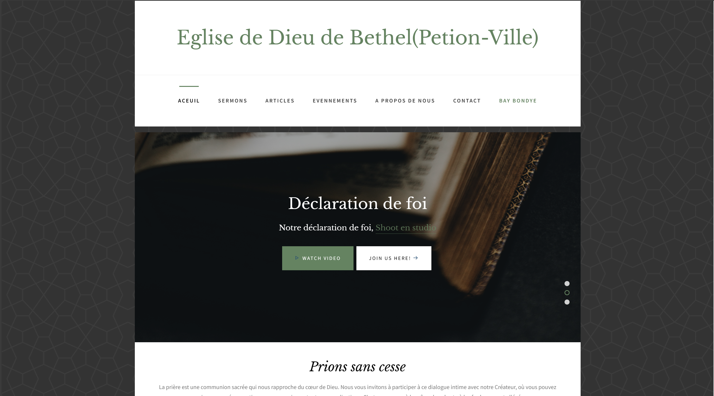
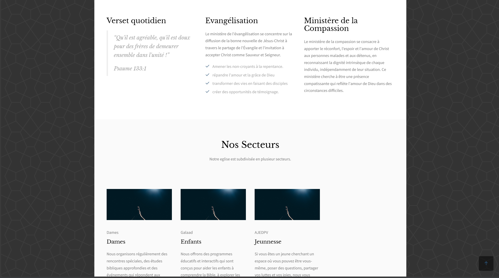

Here’s a `README.md` file for the church website project built with Django:

---

## Screenshots







# Church Website

This project is a fully-featured **Church Website** designed with Django. The platform provides an intuitive user experience for members, visitors, and church administrators. It offers rich content management with sections for articles, sermons, and fundraising. It also integrates PayPal for donations, displays live service information, and tracks fundraising efforts in real time. The site includes a robust admin panel for managing content, donations, and member data efficiently.

## Features

### 1. **Articles Section**
- A blog-like section where church administrators can post news, updates, or religious articles.
- Each article includes categories, tags, author details, and publishing dates.
- Visitors can browse and search articles by topic or author.

### 2. **Sermons**
- A dedicated section where church sermons (audio or video) are uploaded and available for streaming.
- Sermons can be organized by date, speaker, and sermon series.
- Users can easily share sermons on social media or download them for offline listening.

### 3. **Online Donations via PayPal**
- Seamless **PayPal** integration for users to donate to the church securely.
- Users can give one-time donations or set up recurring donations to support the church's ministries.
- A donation tracker to monitor overall progress toward fundraising goals.

### 4. **Fundraising Tracker**
- A system that monitors and displays fundraising campaigns on the site.
- The progress of each campaign is updated in real-time, allowing users to see how close the church is to reaching its goals.
- Administrators can set fundraising targets and track donations directly from the admin panel.

### 5. **Live Service Information**
- A section that provides details about ongoing and upcoming live services, including times, dates, and streaming links.
- Information about physical or online church services is updated regularly to keep members informed.

### 6. **User Authentication and Member Profiles**
- Members can register and create accounts to track their donation history, save sermons, and subscribe to newsletters.
- Profile management allows users to edit their information, track their giving history, and receive personalized notifications.

### 7. **Admin Panel**
- A comprehensive **Django Admin** interface that allows church staff to manage the entire website:
  - Create, edit, and delete articles and sermons.
  - View donation reports and manage fundraising campaigns.
  - Monitor site activities, including user registrations, donation logs, and sermon views.

## Technologies Used

### **Backend**
- **Django (Python)**: The core framework used for handling server-side logic, templating, and database management.
- **Django Rest Framework**: For any APIs that may be needed, particularly for fundraising and donation tracking.
- **PayPal API**: Integrated to securely process online donations.

### **Frontend**
- **HTML5, CSS3**: Used to structure and style the front end of the website.
- **JavaScript (ES6+)**: Adds interactivity, such as donation progress bars, filtering articles/sermons, and live service countdowns.
- **Bootstrap**: Provides a responsive and consistent layout across different devices.

### **Payments**
- **PayPal API**: Integrated for secure and easy online donation processing.

### **Database**
- **PostgreSQL**: The database used to store user information, donations, articles, sermons, and other church-related content.

### **File Storage**
- **Amazon S3** (optional): For securely storing and serving media files (e.g., sermon videos, images).

### **Environment Management**
- **Python-Decouple**: For managing environment-specific configurations.
- **dotenv**: For handling environment variables like database credentials, secret keys, and API keys.

### **Version Control**
- **Git**: Version control system for tracking changes and collaboration.
- **GitHub**: Repository hosting for version control and collaboration.

## Setup Instructions

To set up and run the project locally, follow these steps:

### 1. Clone the Repository
```bash
git clone https://github.com/your-username/church-website.git
cd church-website
```

### 2. Create a Virtual Environment
```bash
python3 -m venv venv
source venv/bin/activate  # On Windows, use `venv\Scripts\activate`
```

### 3. Install Dependencies
```bash
pip install -r requirements.txt
```

### 4. Configure Environment Variables
Create a `.env` file and set the necessary environment variables, such as:
```bash
SECRET_KEY=your-django-secret-key
DEBUG=True  # Set to False for production
DATABASE_URL=your-postgresql-database-url
PAYPAL_CLIENT_ID=your-paypal-client-id
PAYPAL_SECRET=your-paypal-secret
AWS_ACCESS_KEY_ID=your-aws-access-key  # If using Amazon S3
AWS_SECRET_ACCESS_KEY=your-aws-secret-key  # If using Amazon S3
```

### 5. Apply Database Migrations
```bash
python manage.py migrate
```

### 6. Create a Superuser
```bash
python manage.py createsuperuser
```

### 7. Run the Development Server
```bash
python manage.py runserver
```

The site will be available at `http://127.0.0.1:8000/`.


## Contributions

We welcome contributions from the community! If you’d like to contribute to this project, feel free to fork the repository, create a new branch for your feature or bug fix, and submit a pull request. Please make sure your changes adhere to the project’s code standards and that they are thoroughly tested.

## License

This project is licensed under the MIT License. See the [LICENSE](LICENSE) file for more details.

## Contact

If you have any questions, feedback, or suggestions, feel free to reach out via [email](mailto:jeanmaryisai@gmail.com) or connect with me on [LinkedIn](https://linkedin.com/in/jeanmaryisai).

---

Let me know if you'd like to add or modify anything!
